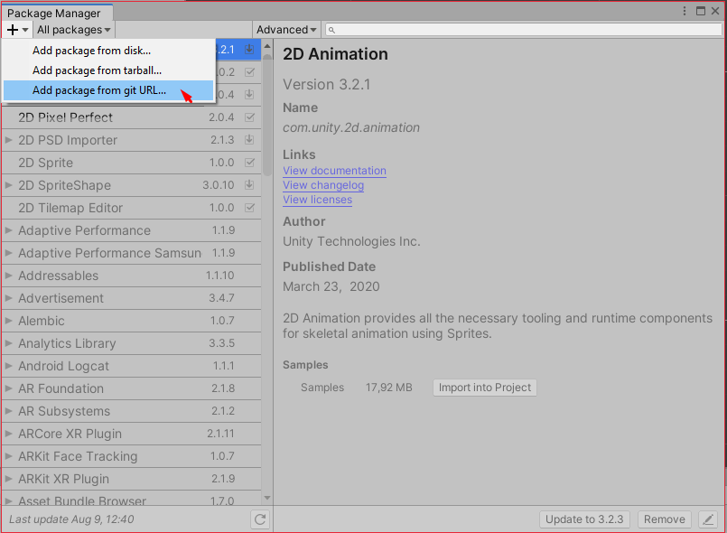
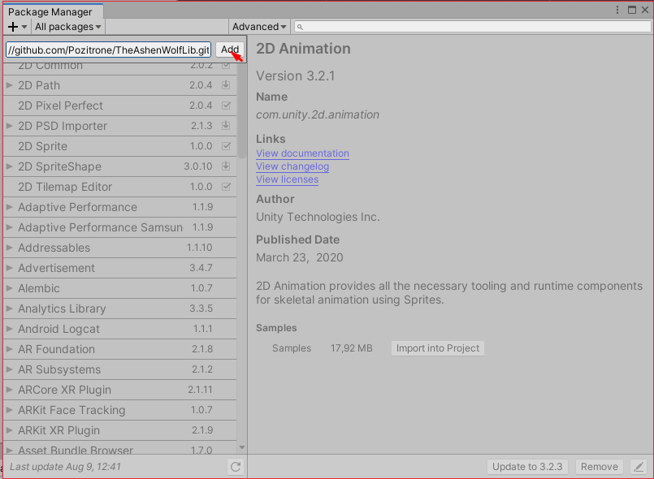
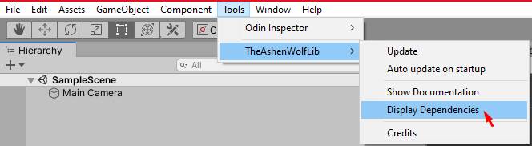
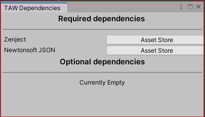
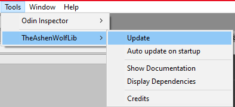

# TheAshenWolfLib
*com.theashenwolf.lib*  

---
Unity library of custom functions to use in general apps, games and more!

## Installation

**Git url:** https://github.com/TheAshenWolf/TheAshenWolfLib.git

1. Open package manager and click "Add from git URL"

2. Paste in the git URL and hit "Add"

3. Go to Tools > TheAshenWolf > Display Dependencies to see all dependencies  

4. Install all dependencies from the asset store  

5. You are done!

## Updating
You can either manually update by clicking the "Update" button under Tools > TheAshenWolf,
or you can turn on automatic updating. This triggers the update every time you start up Unity.  

